<h3><code>sahil@github ~ $ ./contributions.sh</code></h3>

 
 

<h3><code>sahil@github ~ $ whoami</code></h3>

<table>
<tr>
<td valign="top"></td>
<td valign="top"></td>
</tr>
</table>

 
 

<h3><code>sahil@github ~ $ ./links.sh</code></h3>

<b>AI / ML Engineer &nbsp;·&nbsp; CS Undergrad</b>

 

